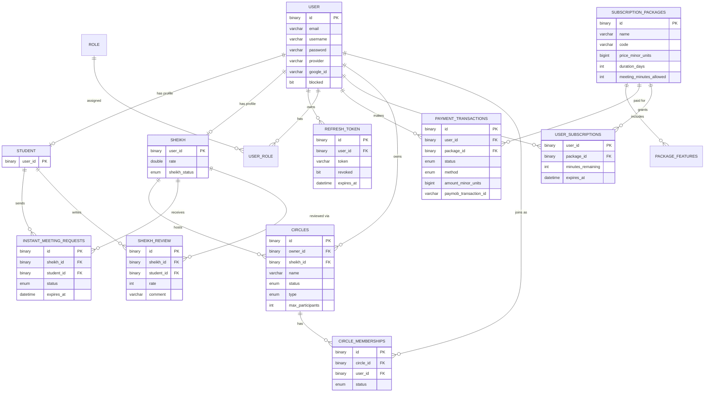

<div align="center">

# 📖 Al-Mahir | الماهر بالقرآن

**Combining Quran memorization with Artificial Intelligence**
**دمج حفظ القرآن الكريم مع الذكاء الاصطناعي**

[](https://openjdk.org/)
[](https://spring.io/projects/spring-boot)
[](https://www.mysql.com/)
[](https://redis.io/)
[](#license)

[View Presentation](https://canva.link/knpxwvw2qjafmr5) · [Report Bug](https://github.com/Ahmed12362/almahir/issues) · [Request Feature](https://github.com/Ahmed12362/almahir/issues)

</div>

---

## Overview

**Al-Mahir** is a Quran learning platform built as a graduation project for the **9-Month Professional Training Program – Java Web Development** at the **Information Technology Institute (ITI)**.

The platform blends traditional, teacher-led Quran learning with modern technology — allowing students to practice recitation, get AI-powered feedback, book live sessions with certified Sheikhs, and manage their subscriptions, all from one place.

📽️ **[View the full project presentation on Canva](https://canva.link/knpxwvw2qjafmr5)**

---

## The Problem

Learning to recite the Quran correctly (Tajweed) traditionally depends entirely on the availability of a qualified teacher for real-time correction. This creates real barriers:

- Limited access to qualified Sheikhs, especially outside major cities
- Difficulty scheduling consistent, recurring sessions
- No instant feedback between sessions to track improvement
- Manual, offline management of subscriptions and learning progress

## Our Solution

Al-Mahir addresses this by combining two learning paths in a single platform:

- **AI-assisted practice** — students can practice recitation anytime and receive automated feedback
- **Live human guidance** — students can still connect with real, vetted Sheikhs through real-time audio/video circles for correction and Ijazah-style mentorship

This hybrid model keeps the authenticity of traditional learning while removing the friction of scheduling and access.

---

## Key Features

- 🔐 Secure authentication for Students, Sheikhs, and Admins (JWT + Google OAuth2)
- 🎙️ AI-powered Quran recitation analysis and feedback
- 👳 Sheikh discovery, profiles, and admin-gated approval workflow
- 🕋 Live learning **Circles** (real-time sessions) with join/host flows
- 📅 Instant meeting requests between students and Sheikhs
- 🔔 Real-time status & event updates via WebSockets (availability, meeting requests, circle status)
- 💳 Subscription packages with secure Paymob payment integration
- ⭐ Sheikh reviews & ratings
- 📖 Tafsir catalog with multiple editions, browsable in-app
- 🖼️ Profile picture & media hosting via Cloudinary
- 🛠️ Admin dashboard for managing users, Sheikhs, and transactions
- ⏰ Scheduled background jobs (e.g. auto-expiring stale meeting requests)

---

## System Architecture

Al-Mahir was built by five collaborating teams, each owning a layer of the product:

| Team | Responsibility |
|---|---|
| **Backend** | REST APIs, business logic, integrations, real-time layer *(this repo)* |
| **Android** | Native Android client |
| **iOS** | Native iOS client |
| **AI** | Recitation analysis engine |
| **Testing** | QA & test coverage |

The backend exposes REST APIs and a WebSocket/STOMP layer that all client apps (Android/iOS) consume, and integrates with external services for payments, media hosting, and email.

## Backend Responsibilities

The Backend team was responsible for:

- Designing and implementing all REST APIs consumed by the Android and iOS apps
- Authentication & authorization (JWT, refresh tokens, Google OAuth2, role-based access for Students/Sheikhs/Admins)
- Business logic for circles, meeting requests, subscriptions, and reviews
- Real-time communication layer (WebSocket/STOMP) to keep Sheikh availability and session state in sync across clients
- Payment integration with Paymob, including **handling concurrent requests, webhook processing, retries, and network-failure scenarios** to keep payment and subscription state consistent
- Third-party integrations: Cloudinary (media), Agora (real-time audio/video tokens), Redis (caching), SMTP (OTP emails)
- Scheduled background jobs (e.g. expiring stale meeting requests)
- API documentation via Swagger/OpenAPI

---

## Tech Stack

**Core**
- Java 21, Kotlin 2.2.20 (interop)
- Spring Boot 4.1
- Spring Security, Spring Data JPA / Hibernate
- Spring WebSocket (STOMP)
- MySQL
- Redis (caching)

**Auth & Security**
- JWT (jjwt)
- Google OAuth2 (`google-api-client`)
- OTP-based email verification for password recovery

**Integrations**
- **Paymob** – payment processing & webhooks
- **Cloudinary** – image/media hosting & CDN
- **Agora** – real-time audio/video session tokens
- **Spring Mail** – transactional/OTP emails

**Tooling**
- MapStruct – DTO ↔ Entity mapping
- Lombok
- springdoc-openapi (Swagger UI)
- Maven

---

## Authentication & Security

Al-Mahir supports three roles — **Student**, **Sheikh**, and **Admin** — each with dedicated auth endpoints and access rules.

- **Registration** — multipart endpoint (`/api/{user|sheikh}/register`) accepting a JSON payload + optional profile picture, uploaded to Cloudinary. Sheikh accounts are created with a `PENDING_APPROVAL` status and must be approved by an Admin before they can log in as a Sheikh.
- **Login** — `/api/{user|sheikh|admin}/login`, credential-based via Spring Security's `AuthenticationManager`, scoped so a Student can't log into the Sheikh app and vice versa.
- **Google OAuth2 login** — `/api/{user|sheikh}/google`, verifies the Google ID token server-side, links or creates an account, and returns tokens. Automatically detects and reports if a Google account already exists under a different role.
- **JWT access & refresh tokens** — short-lived access tokens (default 24h) + longer-lived, revocable refresh tokens (default 7 days) stored server-side, with a dedicated `/refresh` and `/logout` (revoke) flow per role.
- **Forgot password (OTP flow)** — `/forgot-password/verify-email/{email}` sends a 6-digit OTP via email → `/verify-otp/{otp}/{email}` validates it → `/change-password/{email}` resets the password, only after successful OTP verification.
- Blocked users and pending-approval Sheikhs are rejected at login even with valid credentials.

---

## Real-Time Communication

WebSockets (STOMP over Spring's WebSocket support) keep all connected clients in sync without polling. This is used to:

- Notify students in real time when a Sheikh's availability changes
- Push meeting request events (created, accepted, expired) to the relevant Sheikh/student
- Broadcast circle status changes (started, joined, ended) to participants

---

## Payment Integration

Subscriptions are purchased and managed through **Paymob**. Because payments involve external, asynchronous, and sometimes unreliable network calls, the backend was designed to handle:

- **Concurrency** — preventing duplicate/overlapping payment intentions for the same user
- **Webhook processing** — verifying Paymob webhook signatures via HMAC before trusting any payment status update
- **Retries & failure recovery** — gracefully handling network interruptions and Paymob downtime without corrupting subscription state
- Card and (optionally) wallet integrations, with a dedicated debug controller for inspecting webhook payloads during development

---

## Quran & Tafsir

The platform includes a Tafsir module that fetches and locally catalogs Tafsir editions from an external CDN source, exposing a searchable, structured API for the client apps to browse alongside recitation practice.

## AI Recitation Analysis

Recitation analysis is powered by a dedicated **AI team's** model, which the backend integrates with to receive feedback on a student's Quran recitation (Tajweed correctness). The backend is responsible for orchestrating the request/response flow between the client apps and the AI service, and persisting the resulting feedback against the student's progress.

---

## Database Schema

The core data model revolves around **users** (with `student` / `sheikh` sub-profiles), **circles** (live group sessions), **instant meeting requests** (1:1 sessions), and **subscriptions/payments**.



> Diagram reflects the current JPA entity relationships (users/roles, circles & memberships, instant meeting requests, subscriptions, payments, and reviews).

---

## Project Structure

```
src/main/java/com/almahir/iti
├── client/            # External API clients (Paymob, Tafsir)
├── config/            # Spring configuration (Security, Cache, WebSocket, Cloudinary, OpenAPI...)
├── controller/        # REST controllers
├── data/               # Seeders & data initializers
├── dto/
│   ├── request/        # Incoming request payloads
│   └── response/       # Outgoing response payloads
├── exception/          # Custom exceptions + global exception handler
├── mapper/             # MapStruct mappers (Entity ↔ DTO)
├── model/               # JPA entities
│   └── enums/           # Domain enums
├── repository/          # Spring Data JPA repositories
│   └── spec/             # JPA Specifications
├── scheduler/            # Scheduled background jobs
└── service/              # Business logic interfaces
    └── impl/               # Business logic implementations
```

---

## Getting Started

### Prerequisites

- Java 21+
- Maven
- MySQL
- Redis
- Accounts/API keys for: Cloudinary, Paymob, Agora, Google OAuth2, an SMTP provider

### Installation

```bash
# Clone the repository
git clone https://github.com/Ahmed12362/almahir.git
cd almahir

# Create a .env file in the project root (see Environment Variables below)

# Run with Maven wrapper
./mvnw spring-boot:run
```

The app will start on `http://localhost:8080` by default (configurable via `PORT`).

---

## Environment Variables

Create a `.env` file in the project root with the following keys:

```env
# Database
DB_URL=jdbc:mysql://localhost:3306/almahir
DB_USERNAME=your_db_username
DB_PASSWORD=your_db_password

# JWT
JWT_KEY=your_jwt_secret_key

# Google OAuth2
GOOGLE_OAUTH_CLIENT_IDS=your_google_client_id

# Cloudinary
CLOUDINARY_CLOUD_NAME=your_cloud_name
CLOUDINARY_API_KEY=your_api_key
CLOUDINARY_API_SECRET=your_api_secret

# Mail (SMTP)
MAIL_HOST=smtp.example.com
MAIL_PORT=587
MAIL_USERNAME=your_email
MAIL_PASSWORD=your_email_password

# Redis
REDISHOST=localhost
REDISPORT=6379
REDISPASSWORD=

# Admin build/seed
ADMIN_BUILD_SECRET=your_admin_build_secret
ADMIN_SEED_USERNAME=admin
ADMIN_SEED_EMAIL=admin@example.com
ADMIN_SEED_PASSWORD=your_admin_password

# Agora
AGORA_APP_ID=your_agora_app_id
AGORA_APP_CERTIFICATE=your_agora_certificate

# Paymob
PAYMOB_SECRET_KEY=your_paymob_secret_key
PAYMOB_PUBLIC_KEY=your_paymob_public_key
PAYMOB_HMAC_SECRET=your_paymob_hmac_secret
PAYMOB_INTEGRATION_ID_CARD=your_card_integration_id
PAYMOB_INTEGRATION_ID_WALLET=

# App base URL (used for Paymob webhook callback)
APP_BASE_URL=https://your-deployed-url.com
```

> ⚠️ Never commit your real `.env` file. It's already excluded via `.gitignore`.

---

## API Documentation

Once the app is running, interactive API docs (Swagger UI) are available at:

```
http://localhost:8080/swagger-ui/index.html
```

Below is the full REST endpoint reference, grouped by controller.

<details>
<summary><strong>Auth</strong> — <code>/api/auth</code></summary>

| Method | Endpoint | Description | Auth |
|---|---|---|---|
| POST | `/api/auth/user/register`, `/api/auth/sheikh/register` | Register a Student or Sheikh (multipart: JSON payload + optional profile picture) | Public |
| POST | `/api/auth/user/login`, `/api/auth/sheikh/login`, `/api/auth/admin/login` | Login and receive access + refresh tokens | Public |
| POST | `/api/auth/user/google`, `/api/auth/sheikh/google` | Login/sign up via Google OAuth2 ID token | Public |
| POST | `/api/auth/{user\|sheikh\|admin}/refresh` | Exchange a refresh token for a new access token | Public |
| POST | `/api/auth/logout` | Revoke a refresh token | Public |

</details>

<details>
<summary><strong>Forgot Password</strong> — <code>/forgot-password</code></summary>

| Method | Endpoint | Description | Auth |
|---|---|---|---|
| POST | `/forgot-password/verify-email/{email}` | Verify the email exists and send an OTP | Public |
| POST | `/forgot-password/verify-otp/{otp}/{email}` | Validate the OTP for the given email | Public |
| POST | `/forgot-password/change-password/{email}` | Reset the password after OTP verification | Public |

</details>

<details>
<summary><strong>Students</strong> — <code>/api/students</code></summary>

| Method | Endpoint | Description | Auth |
|---|---|---|---|
| GET | `/api/students` | Paginated list of all students | Authenticated |
| GET | `/api/students/{id}` | Get a student by ID | Authenticated |
| GET | `/api/students/email` | Get a student by email | Authenticated |
| GET | `/api/students/search` | Search students by first/last name | Authenticated |
| GET | `/api/students/search/username` | Search students by username | Authenticated |
| GET | `/api/students/me/subscription-minutes` | Current student's remaining subscription minutes | Authenticated |

</details>

<details>
<summary><strong>Sheikhs</strong> — <code>/api/sheikh</code></summary>

| Method | Endpoint | Description | Auth |
|---|---|---|---|
| GET | `/api/sheikh/search` | Search sheikhs by name | Public |
| GET | `/api/sheikh` | Get all sheikhs | Public |
| GET | `/api/sheikh/email/{email}` | Get a sheikh by email | Public |
| GET | `/api/sheikh/username/{username}` | Get a sheikh by username | Public |
| GET | `/api/sheikh/{id}` | Get a sheikh by ID | Public |
| PUT | `/api/sheikh/{id}` | Update a sheikh's profile (JSON or multipart with picture) | Authenticated |
| POST | `/api/sheikh/{sheikhId}/reviews` | Add a review/rating for a sheikh | Student |
| GET | `/api/sheikh/{sheikhId}/reviews` | Get all reviews for a sheikh | Authenticated |

</details>

<details>
<summary><strong>Circles</strong> — <code>/api/circles</code></summary>

Real-time group study sessions. Requires a STOMP connection at `/ws` for join/start/lifecycle events (see the controller's Swagger description for topic details).

| Method | Endpoint | Description | Auth |
|---|---|---|---|
| POST | `/api/circles` | Create a circle (PUBLIC: Sheikh only, PRIVATE: any user) | Authenticated |
| GET | `/api/circles` | List public circles, optionally filtered by status | Authenticated |
| GET | `/api/circles/{circleId}` | Get circle details | Authenticated |
| PATCH | `/api/circles/{circleId}` | Update circle details (owner only) | Authenticated |
| DELETE | `/api/circles/{circleId}` | Cancel a scheduled circle (owner only) | Authenticated |
| POST | `/api/circles/{circleId}/start` | Start a scheduled circle (owner only) | Authenticated |
| POST | `/api/circles/{circleId}/end` | End an ongoing circle (owner only) | Authenticated |
| POST | `/api/circles/{circleId}/join` | Request to join a circle | Authenticated |
| POST | `/api/circles/join/{token}` | Join a private circle via invite link | Authenticated |
| GET | `/api/circles/{circleId}/pending-requests` | List pending join requests (owner only) | Authenticated |
| POST | `/api/circles/{circleId}/approve/{userId}` | Approve a join request (owner only) | Authenticated |
| POST | `/api/circles/{circleId}/reject/{userId}` | Reject a join request (owner only) | Authenticated |
| POST | `/api/circles/{circleId}/leave` | Leave a circle | Authenticated |
| DELETE | `/api/circles/{circleId}/members/{userId}` | Remove a member (owner only) | Authenticated |
| GET | `/api/circles/{circleId}/members` | List active members | Authenticated |
| GET | `/api/circles/{circleId}/token` | Get an Agora audio/video token (active members only, circle must be ongoing) | Authenticated |
| GET | `/api/circles/mine` | List circles the current user is a member of | Authenticated |
| GET | `/api/circles/mine/private` | List the current user's private circles (as host) | Authenticated |
| GET | `/api/circles/history` | Current user's circle membership history | Authenticated |

</details>

<details>
<summary><strong>Instant Meetings</strong> — <code>/api/instant-meetings</code></summary>

Real-time 1-to-1 meeting requests between Students and Sheikhs. Requires a STOMP connection at `/ws` before creating or accepting a request.

| Method | Endpoint | Description | Auth |
|---|---|---|---|
| PUT | `/api/instant-meetings/sheikh/availability` | Update the current sheikh's availability status | Sheikh |
| GET | `/api/instant-meetings/sheikh/{sheikhId}/availability` | Get a sheikh's current availability | Authenticated |
| POST | `/api/instant-meetings/sheikh/{sheikhId}/request` | Send an instant meeting request to an available sheikh | Student |
| POST | `/api/instant-meetings/{requestId}/accept` | Accept a pending request (returns an Agora token) | Sheikh |
| POST | `/api/instant-meetings/{requestId}/decline` | Decline a pending request | Sheikh |
| POST | `/api/instant-meetings/{requestId}/cancel` | Cancel a pending request | Student |
| GET | `/api/instant-meetings/{requestId}/token` | Refresh the Agora token for an accepted meeting | Authenticated |
| POST | `/api/instant-meetings/{requestId}/end` | End an active meeting | Authenticated |
| GET | `/api/instant-meetings/sheikh/pending` | List pending requests sent to the current sheikh | Sheikh |
| GET | `/api/instant-meetings/student/history` | Current student's meeting history | Student |
| GET | `/api/instant-meetings/sheikh/history` | Current sheikh's meeting history | Sheikh |

</details>

<details>
<summary><strong>Payments</strong> — <code>/api/payment</code></summary>

| Method | Endpoint | Description | Auth |
|---|---|---|---|
| POST | `/api/payment/intentions` | Create a Paymob payment intention for a subscription package | Authenticated |
| GET | `/api/payment/intentions/{id}/status` | Get the status of a payment intention | Authenticated |
| POST | `/api/payment/webhooks/paymob` | Paymob webhook — receives and verifies payment results | Public (HMAC-verified) |
| GET | `/api/payment/packages` | List active, purchasable subscription packages | Public |

</details>

<details>
<summary><strong>Tafsir</strong> — <code>/api/tafsir</code></summary>

| Method | Endpoint | Description | Auth |
|---|---|---|---|
| GET | `/api/tafsir` | Get the tafsir for a given surah/ayah | Public |
| GET | `/api/tafsir/available` | List fully compiled tafsir editions available for download | Public |
| POST | `/api/tafsir/build` | Trigger a full tafsir build for an edition (background job) | Admin secret header |
| GET | `/api/tafsir/build/status` | Check the status of a tafsir build | Admin secret header |
| POST | `/api/tafsir/build/sync` | Sync tafsir metadata from Cloudinary | Admin secret header |

</details>

<details>
<summary><strong>Admin</strong> — <code>/api/admin</code></summary>

| Method | Endpoint | Description | Auth |
|---|---|---|---|
| POST | `/api/admin/sheikhs/{sheikhId}/approve` | Approve a pending sheikh | Admin |
| POST | `/api/admin/sheikhs/{sheikhId}/decline` | Decline a sheikh and block the linked account | Admin |
| POST | `/api/admin/users/{userId}/block` | Block a user and revoke their sessions | Admin |
| POST | `/api/admin/users/{userId}/unblock` | Restore access for a blocked user | Admin |
| POST | `/api/admin/subscription-packages` | Create a new subscription package | Admin |
| GET | `/api/admin/payments` | Paginated list of payment transactions (filterable by status/user/date range) | Admin |
| GET | `/api/admin/students` | Paginated list of all students | Admin |
| GET | `/api/admin/sheikhs` | Paginated list of sheikhs (filterable by status) | Admin |

</details>

---

## Testing

Unit tests are written with JUnit and cover core service logic (e.g. Sheikh and Sheikh Review services). Run them with:

```bash
./mvnw test
```

---

## Team

**Backend Team**
- [Ahmed Mohamed](https://github.com/Ahmed12362)
- [Abdullah](https://github.com/AbdallahElagamy)
- [Ahmed Ramadan](https://github.com/Ahmed-Ramadan-Ahmed)

*(Android, iOS, AI, and Testing teams also contributed to this project.)*

---

## Future Improvements

- Expand AI recitation feedback with more granular Tajweed rule detection
- Add push notifications alongside WebSocket events
- Support additional payment providers
- Add automated integration tests for payment/webhook flows

---

## License

Distributed under the MIT License. See `LICENSE` for more information.

<div align="center">

Made with ❤️ by the Al-Mahir team — ITI 9-Month Java Web Development Program

</div>